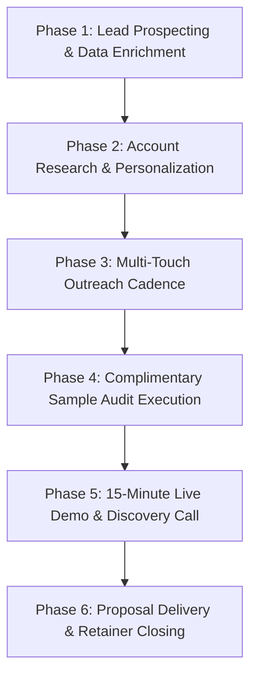

# Autonomous Sales Execution SOP (Standard Operating Procedure)

This is a deterministic, step-by-step operational playbook for executing client prospecting, cold outreach campaigns, sample audit delivery, and closing commercial pilots for **listening.bio**.

---

## Autonomous Execution Workflow



---

## Phase 1: Lead Prospecting & Data Enrichment

### Search Criteria (LinkedIn Sales Navigator / Apollo.io)
1. **Industry Filters**: *Renewable Energy Semiconductor Manufacturing*, *Environmental Services*, *Forestry & Logging*, *Nonprofit Organization Management*.
2. **Headcount**: 50–5,000 employees.
3. **Geography**: United States, Canada, European Union, United Kingdom.
4. **Target Job Titles**:
   * `"Director of Environmental Permitting"`
   * `"VP Sustainability"`
   * `"Principal Ecologist"`
   * `"Head of Biodiversity"`
   * `"Director of Wildlife Permitting"`
   * `"Lead Bioacoustician"`
   * `"Head of Nature Tech"`

### Verification Checklist Before Sending
- [ ] Email address verified with SMTP ping / zero-bounce tool.
- [ ] Account has active solar, wind, timberland, or conservation projects.
- [ ] Lead has not been contacted within the last 60 days.

---

## Phase 2: Account Research & Personalization

Before firing Touch 1, the agent must extract two dynamic variables:
1. `{{project_name}}`: Name of an active project, wind/solar site, or nature preserve managed by the target account.
2. `{{target_species}}`: Local species of regulatory interest (e.g. Indiana Bat, Golden-winged Warbler, Wood Thrush, Desert Tortoise).

---

## Phase 3: Multi-Touch Outreach Cadence

| Day | Channel | Action | Template |
| :--- | :--- | :--- | :--- |
| **Day 1** | Email | Send Touch 1 (Initial Hook + Free 24h Sample Audit Offer) | See `VERTICAL-SALES-KITS.md` for specific vertical |
| **Day 1** | LinkedIn | Send connection request with personalized note (under 200 chars) | `"Hi [Name], saw your work on [Project]. We run autonomous acoustic wildlife surveys for TNFD/EIA compliance. Would love to connect."` |
| **Day 4** | Email | Send Touch 2 (Case study metrics + ROI Calculator link) | Reference 68% cost reduction & Central Park pilot data |
| **Day 8** | Email | Send Touch 3 (Executive 1-page compliance spec & break-up) | Share data sovereignty terms & sample TNFD export |

---

## Phase 4: Complimentary Sample Audit Execution

When a prospect replies with interest or uploads a sample audio clip:

```bash
# 1. Ingest client sample WAV via API or script
curl -X POST "http://localhost:8000/audio-files/upload" \
  -F "site_id=site_client_demo" \
  -F "file=@client_sample.wav"

# 2. Run BirdNET inference pipeline
curl -X POST "http://localhost:8000/processing-jobs/{job_id}/run-birdnet"

# 3. Export audit-ready TNFD and Evidence packages
curl -s "http://localhost:8000/exports/tnfd-biodiversity.json?project_id={proj_id}" > tnfd_audit.json
curl -s "http://localhost:8000/exports/evidence-package.md?project_id={proj_id}" > evidence_package.md
```

* **Deliverable**: Email back a 1-page PDF summary containing the spectrogram visual, detected species list with confidence intervals, and the download link to the interactive web demo.

---

## Phase 5: 15-Minute Live Demo Call Playbook

### Agenda
1. **Minutes 0–3: Pain Discovery & Context Setting**:
   * *"How are you currently managing wildlife survey schedules and nocturnal/crepuscular observation gaps?"*
   * *"What are your main regulatory requirements for upcoming permitting milestones (TNFD, USFWS, CSRD)?"*
2. **Minutes 3–8: Live Product Demonstration**:
   * Open `https://hookrscare.github.io/listening-bio/`.
   * Trigger the 3D Taxonomic Galaxy and play candidate species calls.
   * Demonstrate the **Interactive Evidence Workspace** showing how every detection links directly to raw audio with cryptographic SHA-256 hashes.
   * Show one-click **TNFD / CSRD JSON & CSV Exports**.
3. **Minutes 8–12: Interactive ROI Financial Calculator**:
   * Open `#enterprise-roi` on the site.
   * Plug in client's exact project acreage and sensor count.
   * Show direct dollar savings compared to manual consulting day-rates.
4. **Minutes 12–15: Closing the 30-Day Commercial Pilot**:
   * *"We typically start with a 30-day proof-of-concept pilot across 3–5 stations ($3,500 – $7,500 total). We deploy the sensors, run BirdNET classification, provide certified reviewer sign-off, and deliver a full audit report. If that sounds aligned, I can send over a 1-page SOW today."*

---

## Phase 6: Commercial Pilot-to-Retainer Conversion

* **Post-Pilot Deliverable (Day 30)**: Present the final **Verified Biodiversity Audit Report**.
* **Retainer Conversion Offer**: Roll 100% of the pilot fee as a credit toward an **Annual Monitoring Retainer** ($1,200 – $2,500 / month).

---

## Phase 7: Objection Handling Matrix

| Prospect Objection | Root Concern | Approved Response |
| :--- | :--- | :--- |
| **"We already work with ecological consulting firms."** | Reluctance to change vendors. | *"We don't replace your ecological consultants—in fact, leading consultancies use our platform to process audio 5x faster. We provide the hardware and cloud intelligence so your biologists spend time on high-value review rather than manual audio listening."* |
| **"AI bird identification isn't reliable enough for legal compliance."** | Fear of false positives / regulatory rejection. | *"We completely agree. Under our governance principles, automated ML detections are strictly treated as candidate evidence. Every compliance export requires secondary review and digital sign-off by a qualified ornithologist before submission."* |
| **"Who owns our raw audio data? Will it be used to train public AI models?"** | Confidentiality / Data Sovereignty. | *"You retain 100% exclusive intellectual property ownership over all raw WAV recordings and GPS coordinates. We maintain strict enterprise data sovereignty: your data is never used to train third-party commercial models without written authorization."* |
| **"We don't have budget for a new software platform this quarter."** | Financial inertia. | *"That's why we structured our initial 30-day pilot as a low-cost $3,500 field proof-of-concept, often funded directly out of site survey or contingency budgets rather than software line items."* |
