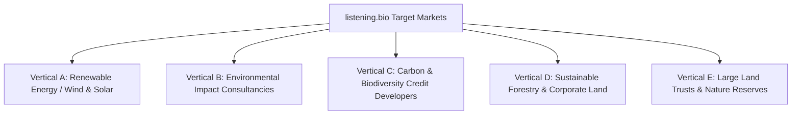

# Potential Client Directory & Target Account Matrix (listening.bio)

This document details the high-value commercial targets for **listening.bio**, categorized across five core buyer verticals with exact decision-maker titles, regulatory drivers, deal sizes, and tailored value hooks.

---

## Target Client Verticals & Account Breakdown

---

### Vertical A: Renewable Energy Developers (Wind & Solar)
* **Regulatory Driver**: Pre-construction Environmental Impact Assessments (EIA), USFWS bat/avian collision risk assessments, and TNFD disclosure obligations.
* **Average Deal Size**: **$15,000 – $60,000 / year** per project site.

| Target Company | Typical Project Type | Key Decision-Maker Titles | Specific Value Hook |
| :--- | :--- | :--- | :--- |
| **NextEra Energy Resources** | Utility-scale wind and solar installations across North America | *VP of Environmental Services*, *Director of Wildlife Permitting*, *Senior Environmental Manager* | Replace episodic consultant site visits with continuous 24/7 acoustic bird/bat presence verification, cutting permitting turnaround by 40%. |
| **Invenergy** | Large-scale wind, solar, and battery storage projects | *Director of Environmental Compliance*, *Lead Ecologist - Permitting* | Continuous acoustic data pipeline providing auditable proof of zero red-listed species disruption for regulatory approvals. |
| **Ørsted (Onshore/Offshore)** | Global renewable energy leader | *Head of Nature & Biodiversity*, *Environmental Permitting Director* | Verifiable biodiversity net-positive metrics required for European and North American green bond covenants. |
| **Avangrid Renewables** | Major onshore wind and solar operator | *Director of Environmental Permitting & Compliance* | Automated acoustic detection of migratory birds and endangered bat calls with certified ecological reviewer sign-off. |
| **EDP Renewables North America** | Utility-scale wind and solar operator | *Senior Environmental Permitting Manager*, *Biodiversity Lead* | Real-time biophony monitoring dashboards for ongoing post-construction compliance reporting. |

---

### Vertical B: Environmental Impact Consultancies (Channel Partners)
* **Commercial Driver**: Labor cost reduction; transform one-off survey hours into high-margin recurring passive acoustic monitoring (PAM) retainer packages.
* **Average Deal Size**: **$10,000 – $50,000+** (multiple client projects per consultancy).

| Target Company | Typical Services | Key Decision-Maker Titles | Specific Value Hook |
| :--- | :--- | :--- | :--- |
| **WSP Global / WSP USA** | Environmental permitting, biodiversity impact assessments | *Director of Ecological Services*, *Principal Bioacoustician*, *VP Sustainability* | Process hundreds of audio hours in minutes with BirdNET + expert sign-off, expanding billable acoustic survey capacity without adding headcount. |
| **ERM (Environmental Resources Management)** | Corporate ESG, TNFD reporting, EIA | *Global Lead - Biodiversity & Nature*, *Partner - Ecological Impact* | Turnkey TNFD v1.0 and CSRD ESRS E4 compliant JSON/CSV reporting export engine for corporate clients. |
| **Stantec** | Environmental sciences, wildlife telemetry, impact modeling | *Ecological Practice Leader*, *Senior Wildlife Biologist* | Standardized acoustic survey SOPs, SHA-256 raw file provenance, and automated species matrix generation. |
| **AECOM** | Infrastructure permitting and environmental planning | *VP of Environmental Sciences*, *Natural Resources Practice Leader* | Multi-sensor cloud dashboard for linear infrastructure (pipelines, rail, transmission lines) monitoring. |
| **SWCA Environmental Consultants** | Focused natural resource management and wildlife permitting | *Bioacoustics Program Lead*, *Director of Natural Resources* | Scalable cloud backend for existing AudioMoth and Song Meter fleets with automated classification. |

---

### Vertical C: Nature-Based Carbon & Biodiversity Credit Developers (MRV)
* **Commercial Driver**: Independent third-party Measurement, Reporting & Verification (MRV) to prove ecological integrity and sell credits at premium prices.
* **Average Deal Size**: **$20,000 – $80,000 / project**.

| Target Company | Asset Type | Key Decision-Maker Titles | Specific Value Hook |
| :--- | :--- | :--- | :--- |
| **Pachama** | Forest carbon projects, digital MRV verification | *Head of Nature Tech*, *Chief Science Officer*, *Director of Forest Science* | Acoustic biodiversity verification layer augmenting satellite biomass data to prove faunal recovery in reforested zones. |
| **Earthshot Labs** | Biome-level carbon & biodiversity credit generation | *Director of Science*, *VP of Ecological Monitoring* | Continuous biophony index (NDSI) tracking and species richness curves for verified biodiversity credits. |
| **Finite Carbon** | North America's leading developer of forest carbon offsets | *Director of Carbon Forestry*, *Head of Technical Operations* | Multi-year acoustic baseline datasets proving long-term wildlife habitat retention under improved forest management (IFM). |
| **BioCarbon Registry** | International carbon and biodiversity credit standard | *Technical Director*, *Head of Methodology* | Standardized acoustic evidence packages with full raw file cryptographic integrity. |

---

### Vertical D: Sustainable Forestry & Corporate Land Management
* **Commercial Driver**: SFI (Sustainable Forestry Initiative) and FSC (Forest Stewardship Council) certification maintenance, corporate biodiversity reporting.
* **Average Deal Size**: **$12,000 – $40,000 / year**.

| Target Company | Land Base | Key Decision-Maker Titles | Specific Value Hook |
| :--- | :--- | :--- | :--- |
| **Weyerhaeuser** | Largest private owner of timberlands in North America (11M+ acres) | *Director of Environmental Affairs*, *VP of Sustainable Forestry* | Scalable acoustic sampling to demonstrate biodiversity co-existence across harvest rotations for ESG reporting. |
| **Timberland Investment Resources (TIR)** | Institutional timberland investment manager | *Director of Sustainability & ESG*, *Forestry Operations Manager* | Turnkey biodiversity health scores and auditable species presence data for institutional pension fund investors. |
| **The Forestland Group** | Natural forest management investment fund | *Chief Sustainability Officer*, *Ecological Forestry Director* | Continuous acoustic verification of canopy species richness in FSC-certified hardwood forests. |

---

### Vertical E: Large Land Trusts & Conservation Organizations
* **Commercial Driver**: Grant fulfillment, donor transparency, and long-term ecological stewardship monitoring.
* **Average Deal Size**: **$5,000 – $25,000 / grant pilot**.

| Target Organization | Geographic Focus | Key Decision-Maker Titles | Specific Value Hook |
| :--- | :--- | :--- | :--- |
| **The Nature Conservancy (TNC)** | Global nature reserves and conservation easements | *Director of Conservation Technology*, *Lead Scientist*, *Preserve Manager* | Low-cost solar PAM sensor hubs enabling continuous multi-year monitoring across remote easements. |
| **Trust for Public Land (TPL)** | Urban parks, community forests, public lands | *Director of Park Science*, *VP of Land Protection* | Community-verifiable acoustic evidence packages demonstrating urban biodiversity uplift for municipal grant reporting. |
| **National Audubon Society** | Priority bird habitats and flyways | *VP of Science*, *Director of Bird Conservation* | Specialized avian bioacoustic pipeline integrated with BirdNET and validated by certified ornithological reviewers. |
| **Central Park Conservancy** | Premier urban green space (NYC) | *Vice President for Park Park Management*, *Director of Natural Resources* | 30-day urban wildlife acoustic study protocol measuring migratory stopover and dawn chorus biophony. |
